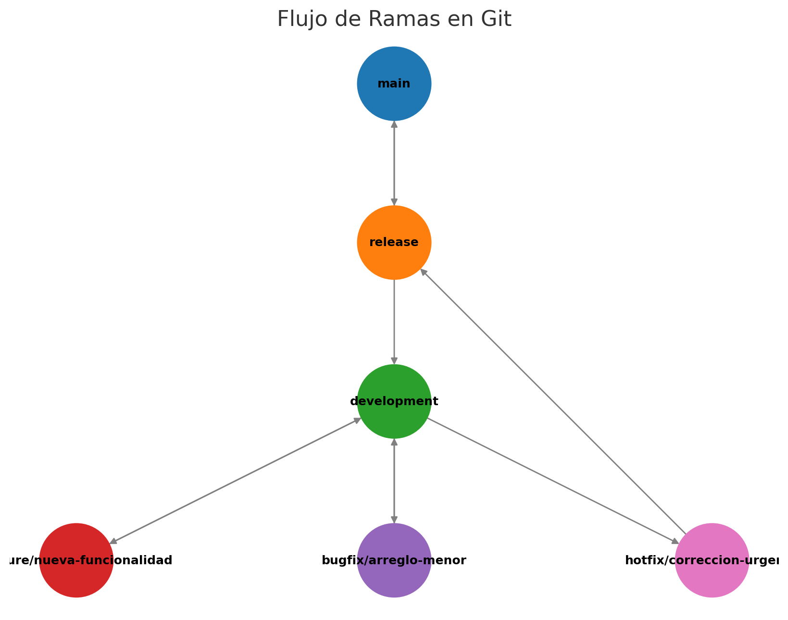

# 📡 Wifi Analytics - NodeAnalytics Service

## 📌 Descripción del Proyecto
Este proyecto es un servicio en **NestJS** para la analítica de redes WiFi, que permite gestionar y almacenar datos sobre conexiones, usuarios y estadísticas de rendimiento.

### 🛠️ Tecnologías Utilizadas
- **NestJS** como framework backend.
- **MySQL** como base de datos.
- **TypeORM** para gestión de entidades y base de datos.
- **Docker** para despliegue y gestión de servicios.

## 🚀 Cómo Levantar el Proyecto

### 🔹 **1️⃣ Clonar el repositorio desde GitLab**  
Este proyecto está alojado en **GitLab**, por lo que necesitas clonar el repositorio desde **GitLab Repositories**.  

#### 📌 **Requisitos previos**  
Antes de clonar, asegúrate de tener instalado:
- **Git** (descargar desde [git-scm.com](https://git-scm.com/))

#### 📌 **Comando para clonar el repositorio**  
Ejecuta el siguiente comando en tu terminal (**CMD, PowerShell o Git Bash**):

```sh
git clone https://gitlab.com/tu-usuario/wifi_analytics-nodeanalytics-service.git
```

Después de clonar el repositorio, sigue estos pasos para ejecutar correctamente el proyecto en tu máquina local.

---

### 🔹 **2️⃣ Ingresar al directorio del proyecto**  
Una vez clonado el repositorio, se debe entrar en la carpeta del proyecto con el siguiente comando:

```sh
cd wifi_analytics-nodeanalytics-service
```

#### 🔹 **Instalación de dependencias**
Para que el proyecto puedo funcionar correctamente se debe levantar las dependencias necesarias, mediante el siguiente comando

```sh
npm install
```

#### 🔹 **Configuración de la base de datos**
El proyecto usa MySQL, por lo que necesitas configurarlo antes de ejecutar la aplicación.

##### **📌 Pasos para configurar MySQL**

1️⃣ Asegúrate de que MySQL esté instalado y corriendo en tu máquina.

2️⃣ Crea una base de datos llamada wifi_analytics (o la que prefieras).

3️⃣ Editar el archivo src/app.module.ts y ajusta las credenciales de conexión.

```sh
TypeOrmModule.forRoot({
  type: 'mysql',
  host: 'localhost',
  port: 3306,
  username: 'root', // Cambia esto según tu configuración
  password: 'password', // Cambia esto según tu configuración
  database: 'wifi_analytics',
  autoLoadEntities: true,
  synchronize: true, // ⚠️ Solo en desarrollo
}),
```
### 🔹 **3️⃣ Ejecución del proyecto**  
#### 📡 WiFi Analytics - NodeAnalytics Service

Sistema migrado de un portal cautivo WiFi desarrollado originalmente en PHP a una arquitectura moderna basada en **NestJS + TypeORM + MySQL**, con separación por módulos y lógica replicada al 100%.

---

##### 🚀 Funcionalidad Principal

Este sistema permite:

- Validar el acceso de un dispositivo por dirección MAC.
- Verificar el estado de nodo y ubicación (`node`, `location`).
- Registrar intentos en `wifi_captive_portal`.
- Consultar opciones de login (social, formulario, staff).
- Determinar la URL de redirección.
- Consultar campañas activas del usuario (`man_campaign`).
- Devolver una respuesta JSON personalizada para mostrar la interfaz de bienvenida.

---

##### 🧩 Módulos del Proyecto

| Módulo     | Descripción |
|------------|-------------|
| `auth`     | Lógica principal de validación y autenticación de dispositivos. |
| `campaigns`| Consulta de campañas activas tipo `WIFI - REGISTER`. |
| `config`   | Configuración general, TypeORM y entorno. |
| `devices`  | Entidad y repositorio de dispositivos (`node`). |
| `locations`| Validación de ubicaciones y URL de redirección. |
| `users`    | Consulta de datos sociales, login y flags (de `man_wifi_social_options`). |
| `wifi`     | Endpoints cautivos como `/auth/validate` para validación de entrada y respuesta dinámica. |

---

## 🔗 Endpoint Principal

### `GET /auth/validate?mac_device=MAC`

Devuelve información completa sobre el estado del nodo, login disponible, redirección y campañas.

#### 📥 Ejemplo Request

```http
GET /auth/validate?mac_device=E8:1C:BA:95:E4:C8
```

#### Ejemplo de Respuesta
```sh
{
  "useranalytics": "innobix",
  "location_name": "matrizinnobix",
  "device": "fortinet",
  "attempt_error": 0,
  "attempt_error_description": "",
  "facebook_login": 1,
  "formulario_login": 0,
  "staff_login": 1,
  "auto_redirect_url": "https://www.nodeanalytics.net",
  "campaigns": [
    {
      "campaign_id": 14,
      "title": "Juega Squash",
      "html": "<div>Campaña especial para...</div>"
    }
  ]
}
```

## 🌿 Flujo de Ramas (`Git Flow`)

Este proyecto sigue un flujo de ramas estructurado en tres niveles principales:

1️⃣ `main` → Contiene solo versiones estables en producción.  
2️⃣ `release` → Se usa para preparar versiones antes de fusionarlas en `main`.  
3️⃣ `development` → Es la rama donde se integran las nuevas funcionalidades antes de pasar a `release`.  

Además, las nuevas funcionalidades y correcciones se desarrollan en ramas temporales:

- **`feature/*`** → Para nuevas características o mejoras (ejemplo: `feature/monitoreo-wifi`).
- **`hotfix/*`** → Para correcciones críticas en producción (ejemplo: `hotfix/seguridad-auth`).
- **`bugfix/*`** → Para corregir errores menores en `development` (ejemplo: `bugfix/fix-login`).



## 📌 Versionamiento

El proyecto sigue el esquema de versionamiento **SemVer (`MAJOR.MINOR.PATCH`)**, que define cómo numerar las versiones del software para garantizar compatibilidad y claridad en los cambios.

| **Formato**  | **Ejemplo** | **Significado** |
|-------------|------------|----------------|
| `MAJOR` (X) | `1.0.0` → `2.0.0` | Cambios grandes que pueden romper compatibilidad con versiones anteriores. |
| `MINOR` (Y) | `1.1.0` → `1.2.0` | Nuevas funcionalidades sin romper compatibilidad. |
| `PATCH` (Z) | `1.1.1` → `1.1.2` | Corrección de errores o mejoras menores. |

---

### 🔹 **Ejemplo de Versionamiento**
| Versión     | Descripción |
|------------|------------|
| **v1.0.0** | Primera versión estable del proyecto. |
| **v1.1.0** | Se agregan nuevas funcionalidades. |
| **v1.1.1** | Se corrigen errores menores. |
| **v2.0.0** | Cambio grande en la arquitectura, rompe compatibilidad con versiones anteriores. |


